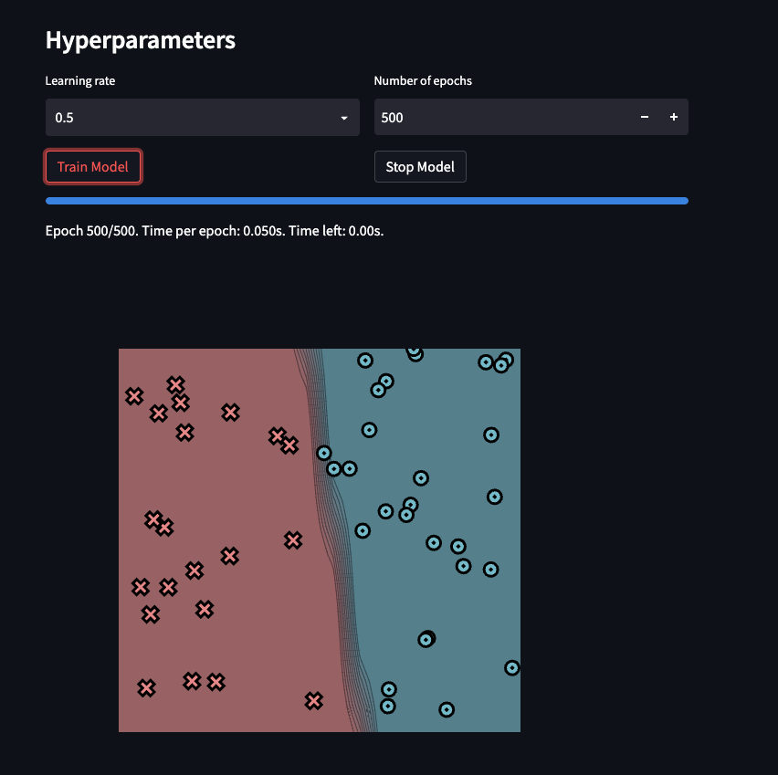
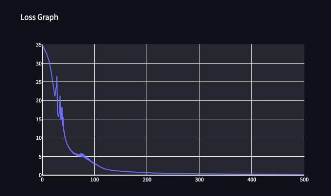
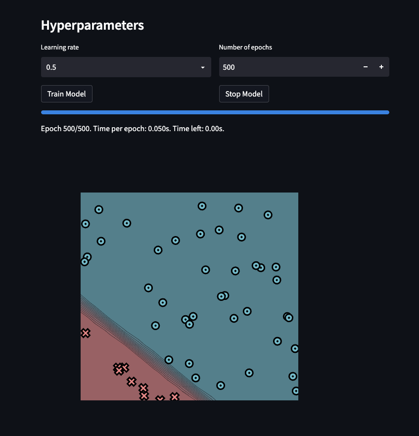
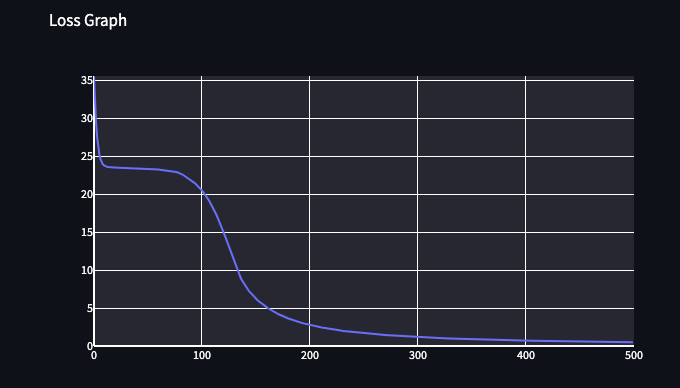
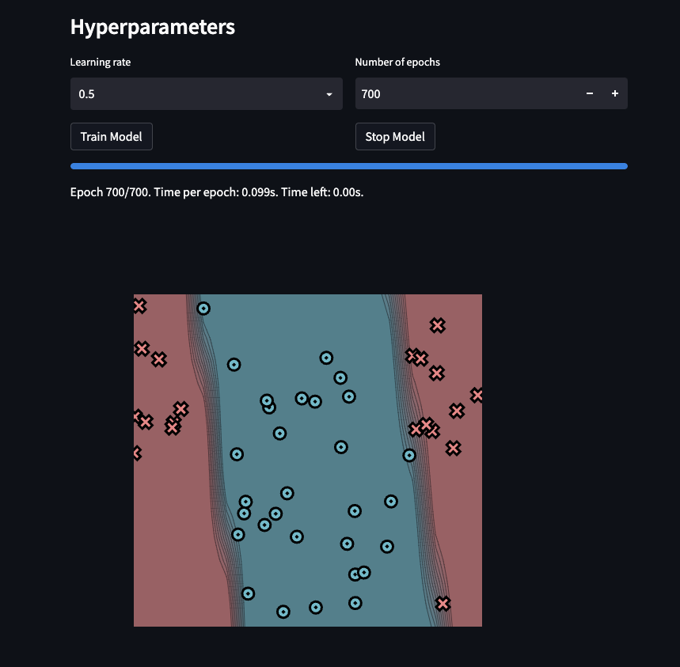
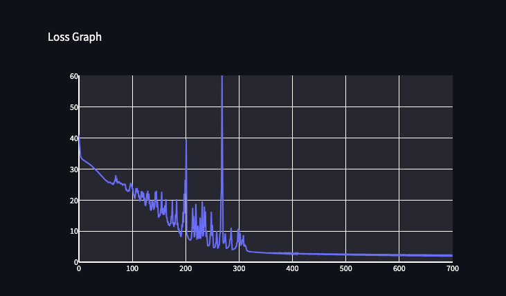
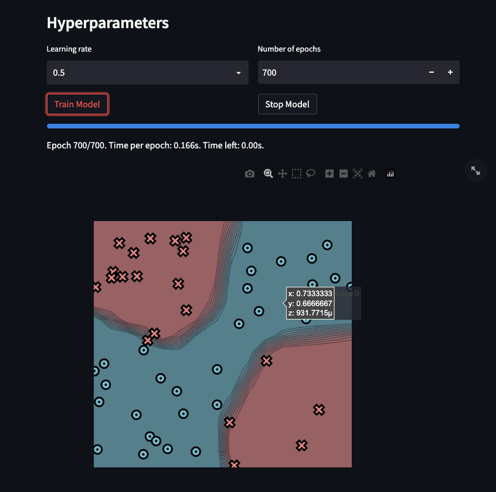
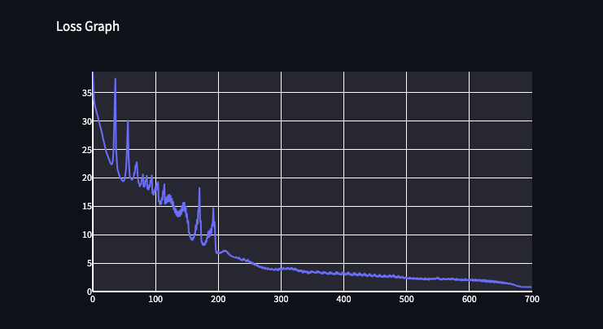

[](https://classroom.github.com/a/YFgwt0yY)
# MiniTorch Module 2


* Docs: https://minitorch.github.io/

* Overview: https://minitorch.github.io/module2/module2/

This assignment requires the following files from the previous assignments. You can get these by running

```bash
python sync_previous_module.py previous-module-dir current-module-dir
```

The files that will be synced are:

        minitorch/operators.py minitorch/module.py minitorch/autodiff.py minitorch/scalar.py minitorch/scalar_functions.py minitorch/module.py project/run_manual.py project/run_scalar.py project/datasets.py


## Task 2.5

### (1) Simple

> learning rate: 0.5

> number of epochs: 500

> Time per epoch: 0.05s

> hidden layers = 2



Log:
```
Epoch: 0/500, loss: 0, correct: 0
Epoch: 10/500, loss: 29.213650914293407, correct: 39
Epoch: 20/500, loss: 21.699869526626866, correct: 46
Epoch: 30/500, loss: 12.398122196989954, correct: 48
Epoch: 40/500, loss: 7.895162054874229, correct: 47
Epoch: 50/500, loss: 7.123374588876541, correct: 46
Epoch: 60/500, loss: 5.332024714562604, correct: 46
Epoch: 70/500, loss: 4.096177895702164, correct: 47
Epoch: 80/500, loss: 3.450314063894406, correct: 49
Epoch: 90/500, loss: 2.6063139457250615, correct: 49
Epoch: 100/500, loss: 1.7958900061736094, correct: 50
Epoch: 110/500, loss: 1.381307107680153, correct: 50
Epoch: 120/500, loss: 1.1931946552615142, correct: 50
Epoch: 130/500, loss: 1.057756273929565, correct: 50
Epoch: 140/500, loss: 0.9483356919033974, correct: 50
Epoch: 150/500, loss: 0.8570551957130096, correct: 50
Epoch: 160/500, loss: 0.7800810155173625, correct: 50
Epoch: 170/500, loss: 0.7141028300308037, correct: 50
Epoch: 180/500, loss: 0.6570417187168602, correct: 50
Epoch: 190/500, loss: 0.607301325571866, correct: 50
Epoch: 200/500, loss: 0.5636349552172423, correct: 50
Epoch: 210/500, loss: 0.5250554974954397, correct: 50
Epoch: 220/500, loss: 0.4907720686838699, correct: 50
Epoch: 230/500, loss: 0.4601443642592554, correct: 50
Epoch: 240/500, loss: 0.4326491300663202, correct: 50
Epoch: 250/500, loss: 0.4078551345703039, correct: 50
Epoch: 260/500, loss: 0.38540422715882144, correct: 50
Epoch: 270/500, loss: 0.3649968283212581, correct: 50
Epoch: 280/500, loss: 0.34638069453310255, correct: 50
Epoch: 290/500, loss: 0.3293421338496414, correct: 50
Epoch: 300/500, loss: 0.3136990764496995, correct: 50
Epoch: 310/500, loss: 0.2992955636100899, correct: 50
Epoch: 320/500, loss: 0.2859973314607722, correct: 50
Epoch: 330/500, loss: 0.27368824698611727, correct: 50
Epoch: 340/500, loss: 0.26226741275244636, correct: 50
Epoch: 350/500, loss: 0.2516468002546242, correct: 50
Epoch: 360/500, loss: 0.2417493040315315, correct: 50
Epoch: 370/500, loss: 0.23250713289074787, correct: 50
Epoch: 380/500, loss: 0.2238604728787546, correct: 50
Epoch: 390/500, loss: 0.21575637058131278, correct: 50
Epoch: 400/500, loss: 0.20814779605150324, correct: 50
Epoch: 410/500, loss: 0.20099285294858338, correct: 50
Epoch: 420/500, loss: 0.19425410992152395, correct: 50
Epoch: 430/500, loss: 0.18789803232461608, correct: 50
Epoch: 440/500, loss: 0.18189449733497326, correct: 50
Epoch: 450/500, loss: 0.17621637869800416, correct: 50
Epoch: 460/500, loss: 0.17083918984157626, correct: 50
Epoch: 470/500, loss: 0.1657407761136071, correct: 50
Epoch: 480/500, loss: 0.16090104851864775, correct: 50
Epoch: 490/500, loss: 0.1563017526395836, correct: 50
Epoch: 500/500, loss: 0.15192626749504884, correct: 50
```


### (2) Diag


> learning rate: 0.5

> number of epochs: 500

> Time per epoch: 0.05s

> hidden layers = 2




Logs:
```
Epoch: 0/500, loss: 0, correct: 0
Epoch: 10/500, loss: 23.803570210682576, correct: 41
Epoch: 20/500, loss: 23.48181261525054, correct: 41
Epoch: 30/500, loss: 23.433767916085618, correct: 41
Epoch: 40/500, loss: 23.389152251300963, correct: 41
Epoch: 50/500, loss: 23.330494438142935, correct: 41
Epoch: 60/500, loss: 23.227354114256887, correct: 41
Epoch: 70/500, loss: 23.05427282530839, correct: 41
Epoch: 80/500, loss: 22.75859229300052, correct: 41
Epoch: 90/500, loss: 21.922219681127356, correct: 41
Epoch: 100/500, loss: 20.61890132478006, correct: 41
Epoch: 110/500, loss: 18.50814780574525, correct: 41
Epoch: 120/500, loss: 15.348822573978072, correct: 41
Epoch: 130/500, loss: 11.42197000030878, correct: 41
Epoch: 140/500, loss: 8.17465728315571, correct: 49
Epoch: 150/500, loss: 6.3528757327702685, correct: 49
Epoch: 160/500, loss: 5.1853751807264885, correct: 50
Epoch: 170/500, loss: 4.322254940023539, correct: 50
Epoch: 180/500, loss: 3.6816146176969013, correct: 50
Epoch: 190/500, loss: 3.181284671103481, correct: 50
Epoch: 200/500, loss: 2.795848898993936, correct: 50
Epoch: 210/500, loss: 2.48550335137866, correct: 50
Epoch: 220/500, loss: 2.23585445660062, correct: 50
Epoch: 230/500, loss: 2.0254184011714886, correct: 50
Epoch: 240/500, loss: 1.8485649432045017, correct: 50
Epoch: 250/500, loss: 1.6967592109196892, correct: 50
Epoch: 260/500, loss: 1.5651279818845685, correct: 50
Epoch: 270/500, loss: 1.4500976015323197, correct: 50
Epoch: 280/500, loss: 1.3488429810384897, correct: 50
Epoch: 290/500, loss: 1.262076338137099, correct: 50
Epoch: 300/500, loss: 1.1827251880711938, correct: 50
Epoch: 310/500, loss: 1.1124054694875987, correct: 50
Epoch: 320/500, loss: 1.0473893314916927, correct: 50
Epoch: 330/500, loss: 0.9911808150681861, correct: 50
Epoch: 340/500, loss: 0.939409891580949, correct: 50
Epoch: 350/500, loss: 0.8908406568249039, correct: 50
Epoch: 360/500, loss: 0.8473087056149042, correct: 50
Epoch: 370/500, loss: 0.8074720405633172, correct: 50
Epoch: 380/500, loss: 0.7708006368525908, correct: 50
Epoch: 390/500, loss: 0.7373096308219295, correct: 50
Epoch: 400/500, loss: 0.7062961463043042, correct: 50
Epoch: 410/500, loss: 0.6766608330036843, correct: 50
Epoch: 420/500, loss: 0.6504616590007325, correct: 50
Epoch: 430/500, loss: 0.6245267741302873, correct: 50
Epoch: 440/500, loss: 0.601770098522633, correct: 50
Epoch: 450/500, loss: 0.5791249674491793, correct: 50
Epoch: 460/500, loss: 0.5592004266479277, correct: 50
Epoch: 470/500, loss: 0.5392845466436664, correct: 50
Epoch: 480/500, loss: 0.5217173603443516, correct: 50
Epoch: 490/500, loss: 0.5040883463325232, correct: 50
Epoch: 500/500, loss: 0.48850234326190956, correct: 50
```

### (3) Split

> learning rate: 0.5

> number of epochs: 700

> Time per epoch: 0.099s

> hidden layers = 4





Logs:
```
Epoch: 10/700, loss: 32.85035284381976, correct: 30
Epoch: 20/700, loss: 31.72152580275861, correct: 33
Epoch: 30/700, loss: 30.247965147916087, correct: 35
Epoch: 40/700, loss: 28.406940320084, correct: 37
Epoch: 50/700, loss: 26.553247867443783, correct: 37
Epoch: 60/700, loss: 25.620077005824577, correct: 44
Epoch: 70/700, loss: 28.023593790759072, correct: 35
Epoch: 80/700, loss: 25.515440198412513, correct: 38
Epoch: 90/700, loss: 23.565045685815733, correct: 39
Epoch: 100/700, loss: 25.23786792553308, correct: 36
Epoch: 110/700, loss: 23.88331560868155, correct: 36
Epoch: 120/700, loss: 22.781571560306475, correct: 37
Epoch: 130/700, loss: 23.0014057401203, correct: 38
Epoch: 140/700, loss: 19.57436856150983, correct: 43
Epoch: 150/700, loss: 14.559592616219497, correct: 44
Epoch: 160/700, loss: 17.470115298486945, correct: 43
Epoch: 170/700, loss: 12.316624756435925, correct: 48
Epoch: 180/700, loss: 12.714561424204977, correct: 46
Epoch: 190/700, loss: 9.720799597424488, correct: 48
Epoch: 200/700, loss: 26.543014149609235, correct: 37
Epoch: 210/700, loss: 7.105537927574524, correct: 47
Epoch: 220/700, loss: 18.772055644659723, correct: 41
Epoch: 230/700, loss: 9.195370957949487, correct: 48
Epoch: 240/700, loss: 10.05230654596722, correct: 47
Epoch: 250/700, loss: 8.433950100976755, correct: 46
Epoch: 260/700, loss: 5.604392344073924, correct: 48
Epoch: 270/700, loss: 9.329279582860448, correct: 48
Epoch: 280/700, loss: 4.656922247822459, correct: 49
Epoch: 290/700, loss: 4.078999938833959, correct: 50
Epoch: 300/700, loss: 6.357381990539895, correct: 47
Epoch: 310/700, loss: 5.0559135482418265, correct: 48
Epoch: 320/700, loss: 3.4163068755837633, correct: 50
Epoch: 330/700, loss: 3.2246287793680866, correct: 50
Epoch: 340/700, loss: 3.0793911114347874, correct: 50
Epoch: 350/700, loss: 2.9601703138239213, correct: 50
Epoch: 360/700, loss: 2.874057794887584, correct: 50
Epoch: 370/700, loss: 2.802975290165681, correct: 50
Epoch: 380/700, loss: 2.7408706379355916, correct: 50
Epoch: 390/700, loss: 2.6836554548631284, correct: 50
Epoch: 400/700, loss: 2.6260134035512572, correct: 50
Epoch: 410/700, loss: 2.569269476930072, correct: 50
Epoch: 420/700, loss: 2.514967646738767, correct: 50
Epoch: 430/700, loss: 2.4800905181036517, correct: 50
Epoch: 440/700, loss: 2.428888691495486, correct: 50
Epoch: 450/700, loss: 2.3973844978066507, correct: 50
Epoch: 460/700, loss: 2.3511454349881853, correct: 50
Epoch: 470/700, loss: 2.310280158520144, correct: 50
Epoch: 480/700, loss: 2.2781293800726896, correct: 50
Epoch: 490/700, loss: 2.249026748119688, correct: 50
Epoch: 500/700, loss: 2.210013740352622, correct: 50
Epoch: 510/700, loss: 2.177577028492965, correct: 50
Epoch: 520/700, loss: 2.152972155104101, correct: 50
Epoch: 530/700, loss: 2.121000879977907, correct: 50
Epoch: 540/700, loss: 2.0948789845439797, correct: 50
Epoch: 550/700, loss: 2.070238741921742, correct: 50
Epoch: 560/700, loss: 2.045741788119646, correct: 50
Epoch: 570/700, loss: 2.0223095078470807, correct: 50
Epoch: 580/700, loss: 1.9995352904401513, correct: 50
Epoch: 590/700, loss: 1.9743487035465763, correct: 50
Epoch: 600/700, loss: 1.9531553284647694, correct: 50
Epoch: 610/700, loss: 1.9355226943115986, correct: 50
Epoch: 620/700, loss: 1.9157635968867497, correct: 50
Epoch: 630/700, loss: 1.895772154405682, correct: 50
Epoch: 640/700, loss: 1.8789575656633335, correct: 50
Epoch: 650/700, loss: 1.859850127174241, correct: 50
Epoch: 660/700, loss: 1.8427530518357593, correct: 50
Epoch: 670/700, loss: 1.8267335496215285, correct: 50
Epoch: 680/700, loss: 1.8100018904988955, correct: 50
Epoch: 690/700, loss: 1.7946492932277858, correct: 50
Epoch: 700/700, loss: 1.7795898810881148, correct: 50
```


### (4) Xor

> learning rate: 0.5

> number of epochs: 700

> Time per epoch: 0.166s

> hidden layers = 5




Logs:
```
Epoch: 10/700, loss: 30.602298400616576, correct: 37
Epoch: 20/700, loss: 25.60443639077362, correct: 44
Epoch: 30/700, loss: 22.441128838023058, correct: 43
Epoch: 40/700, loss: 21.849264161347925, correct: 41
Epoch: 50/700, loss: 19.41715026310601, correct: 43
Epoch: 60/700, loss: 20.02430292701781, correct: 40
Epoch: 70/700, loss: 21.872775736277262, correct: 38
Epoch: 80/700, loss: 19.589795928938997, correct: 40
Epoch: 90/700, loss: 17.844423332857293, correct: 41
Epoch: 100/700, loss: 17.345583534131503, correct: 43
Epoch: 110/700, loss: 15.286185026874845, correct: 44
Epoch: 120/700, loss: 15.63783986490882, correct: 43
Epoch: 130/700, loss: 14.308173394748952, correct: 45
Epoch: 140/700, loss: 13.174106247896383, correct: 46
Epoch: 150/700, loss: 13.027753539031297, correct: 45
Epoch: 160/700, loss: 8.961067351707253, correct: 47
Epoch: 170/700, loss: 14.453142033400999, correct: 44
Epoch: 180/700, loss: 8.180061926221418, correct: 47
Epoch: 190/700, loss: 10.123094309965772, correct: 46
Epoch: 200/700, loss: 6.670430364829761, correct: 48
Epoch: 210/700, loss: 6.987134014249643, correct: 48
Epoch: 220/700, loss: 6.352696495911209, correct: 48
Epoch: 230/700, loss: 6.041327689299898, correct: 48
Epoch: 240/700, loss: 5.65818124988652, correct: 48
Epoch: 250/700, loss: 5.2584547254387735, correct: 48
Epoch: 260/700, loss: 4.820084409380795, correct: 48
Epoch: 270/700, loss: 4.212030274074121, correct: 48
Epoch: 280/700, loss: 4.122829573392733, correct: 48
Epoch: 290/700, loss: 3.8634420192028536, correct: 48
Epoch: 300/700, loss: 4.05317739480607, correct: 48
Epoch: 310/700, loss: 4.2026606947731056, correct: 48
Epoch: 320/700, loss: 4.045669435670365, correct: 48
Epoch: 330/700, loss: 3.772000533238126, correct: 48
Epoch: 340/700, loss: 3.6144675970440576, correct: 48
Epoch: 350/700, loss: 3.6463671861877156, correct: 48
Epoch: 360/700, loss: 3.6470318845267466, correct: 48
Epoch: 370/700, loss: 3.5263812515230812, correct: 48
Epoch: 380/700, loss: 3.4781045559978723, correct: 48
Epoch: 390/700, loss: 3.4968578592483452, correct: 48
Epoch: 400/700, loss: 3.4797071392904404, correct: 48
Epoch: 410/700, loss: 3.280785305853558, correct: 48
Epoch: 420/700, loss: 3.1853706751487016, correct: 48
Epoch: 430/700, loss: 3.0003173865843054, correct: 48
Epoch: 440/700, loss: 2.995461858942001, correct: 48
Epoch: 450/700, loss: 3.1070571649698393, correct: 48
Epoch: 460/700, loss: 2.8750252118585884, correct: 48
Epoch: 470/700, loss: 2.7235580029687276, correct: 48
Epoch: 480/700, loss: 3.001289913974202, correct: 48
Epoch: 490/700, loss: 2.6446645910170172, correct: 49
Epoch: 500/700, loss: 2.579854534048273, correct: 49
Epoch: 510/700, loss: 2.4261626266255356, correct: 49
Epoch: 520/700, loss: 2.3295443953960966, correct: 49
Epoch: 530/700, loss: 2.2968719079568363, correct: 49
Epoch: 540/700, loss: 2.3290234819706415, correct: 49
Epoch: 550/700, loss: 2.5520775610970317, correct: 49
Epoch: 560/700, loss: 2.3569916899445134, correct: 49
Epoch: 570/700, loss: 2.2807471846022307, correct: 49
Epoch: 580/700, loss: 2.1976497059576268, correct: 49
Epoch: 590/700, loss: 2.1820093168167296, correct: 49
Epoch: 600/700, loss: 2.148280628029682, correct: 49
Epoch: 610/700, loss: 2.047664785427076, correct: 49
Epoch: 620/700, loss: 2.0511474148244826, correct: 49
Epoch: 630/700, loss: 1.896699645363339, correct: 49
Epoch: 640/700, loss: 1.7973078242456528, correct: 49
Epoch: 650/700, loss: 1.6838078771141667, correct: 49
Epoch: 660/700, loss: 1.5172468104699872, correct: 49
Epoch: 670/700, loss: 1.272691214884971, correct: 50
Epoch: 680/700, loss: 0.9022782359171013, correct: 50
Epoch: 690/700, loss: 0.8018202512770263, correct: 50
Epoch: 700/700, loss: 0.7795103788153968, correct: 50
```